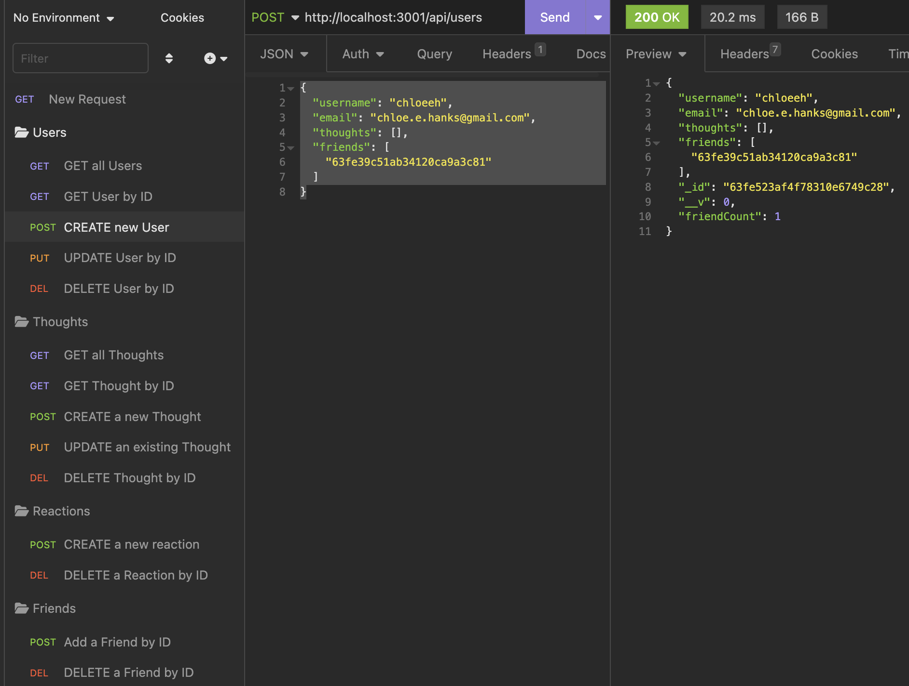

# wk18 - hanks-social-network-api

# Table of Contents
1. [Description](#description)
2. [Installation](#installation)
3. [Video Walk-through](#usage)
4. [Credits](#credits)

## Description

The purpose of this project is to invoke Express, mongodb, mongoose packages in javascript to develop a functional backend for a social network API.

- Insomnia is used to organize the GET, PUT, POST, DELETE routes for _Users_ and _Thoughts_ routes.

### Routes:

Use the following urls to operate on the routes listed in Insomnia:
#### Thought Routes
    - GET all Thoughts:               http://localhost:3001/api/thoughts
    - GET Thought by ID:              http://localhost:3001/api/thoughts/[insert thought ID here]
    - CREATE new Thought:             http://localhost:3001/api/thoughts/
    - UPDATE existing Thought by ID:  http://localhost:3001/api/thoughts/[insert thought ID here]
    - DELETE existing Thought by ID:  http://localhost:3001/api/thoughts/[insert thought ID here]

    - CREATE new Reaction:            http://localhost:3001/api/thoughts/[insert thought ID here]/reactions
    - DELETE Reaction by ID:          http://localhost:3001/api/thoughts/[insert thought ID here]/reactions/[insert reaction ID here]

#### User Routes
    - GET all Users:               http://localhost:3001/api/users
    - GET User by ID:              http://localhost:3001/api/users/[insert user ID here]
    - CREATE new User:             http://localhost:3001/api/users/
    - UPDATE existing User by ID:  http://localhost:3001/api/users/[insert user ID here]
    - DELETE existing User by ID:  http://localhost:3001/api/users/[insert user ID here]

    - ADD new Friend:              http://localhost:3001/api/users/[insert user ID here]/friends
    - DELETE Friend by ID:         http://localhost:3001/api/users/[insert user ID here]/friends/[insert user ID here]

- The package.json file includes a script to run the code automatically instead of using node server.js in conjunction with npm start, etc.

### Faker JS
Faker JS was used to generate the seed data. In sum, this package is used to generate realistic looking, albeit fake, data. See the Credits link listed below for more information.

## Installation

From the command line, run:

- npm init -y

- npm i mongodb

- npm i mongoose

- npm i express

- npm i --save-dev @faker-js/faker

- npm run seed

- npm run start

## Usage

Here's the [link to the video recording](https://drive.google.com/file/d/1QqV9GOSjLX6oKah6K8nUBNaFALIKKayW/view?usp=sharing)

## Credits

Resources used:
1) Bootcamp Pre-work Modules in 18-ORM
2) Documentation linked in the homework activities
3) [Faker JS] (https://www.npmjs.com/package/@faker-js/faker)

## License

Please refer to the LICENSE in the repository.

